<div id="top"></div>

  <h2 align="center">Advanced Programming Project</h2>
  <h3 align="center">Ahmed Walid</h3>
  <h3 align="center">Ahmed Mohamed</h3>
  <h3 align="center">AlSayed Aly</h3>
  
  <p align="center">
    JavaFX Restaurant
    <br />
    <a href="https://github.com/ahmeddwalid/AdvProgProj/blob/main/README.md"><strong>Explore the docs »</strong></a>
    <br />
    <br />
    <a "https://github.com/ahmeddwalid/AdvProgProj/issues">Report Bug</a>
    ·
    <a href="https://github.com/ahmeddwalid/AdvProgProj/pulls">Request Feature</a>
  </p>
</div>


<!-- TABLE OF CONTENTS -->
<details>
  <summary>Table of Contents</summary>
  <ol>
    <li>
      <a href="#about-the-project">About The Project</a>
   </li>
   <li><a href="#features">Features</a></li>
    <li><a href="#the-uml">The UML</a></li>
    <li><a href="#the-runtime">The Runtime</a></li>
    <li><a href="#contributing">Contributing</a></li>
    <li><a href="#license">License</a></li>
    <li><a href="#contact">Contact</a></li>
    <li>
    <a href="#acknowledgments">Acknowledgments</a>
    </li>
  </ol>
</details>


<!-- ABOUT THE PROJECT -->
## About The Project


Modern design responsive restaurant food ordering system implemented using JavaFX


<p align="right">(<a href="#top">back to top</a>)</p>


<!-- FEATURES -->
## Features

- UML diagram
- JavaFX Responsive user friendly GUI
- GUI events with buttons
- JDBC accessing MySQL Database using XAMPP
- Added Login and Signup
- Added 12 app screens
- Using Object-oriented design 
- Written in **clean code** and provided comments
- Added Encapsulation
- Added Polymorphism
- Added Overloading and Overriding
- Used CSS for styling
- Project uploaded on [Github](https://github.com/ahmeddwalid/AdvProgProj)
- Added [screenshots](https://github.com/ahmeddwalid/AdvProgProj/tree/main/Runtime) of the run 

<p align="right">(<a href="#top">back to top</a>)</p>


<!--UML-->
# The UML

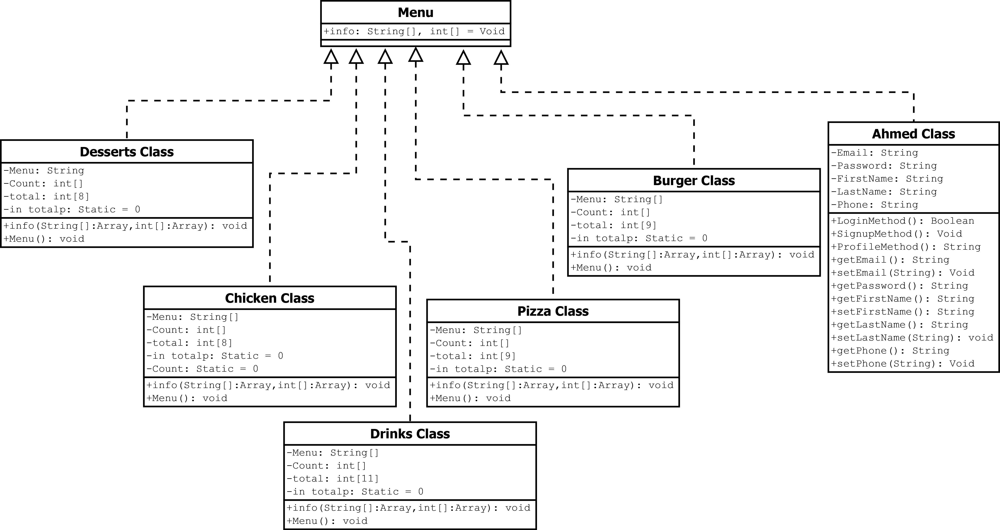

<p align="right">(<a href="#top">back to top</a>)</p>


<!--RUNTIME-->
# The Runtime

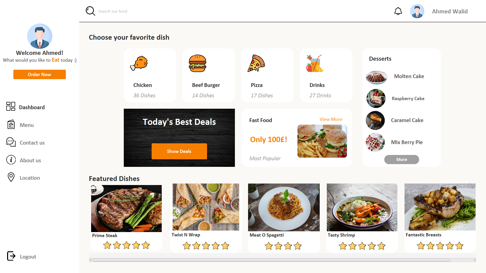
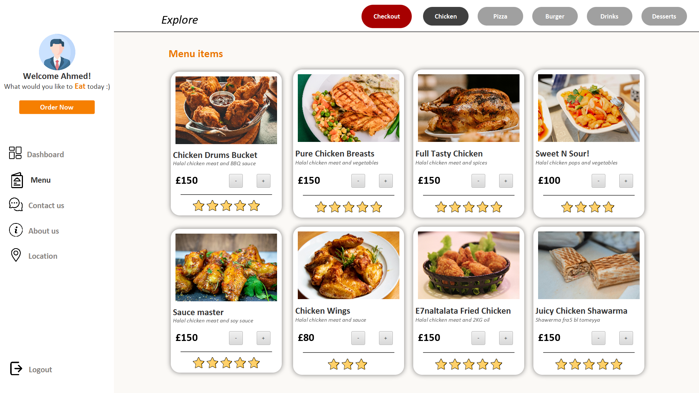
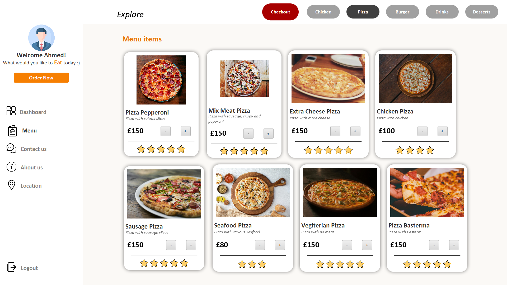
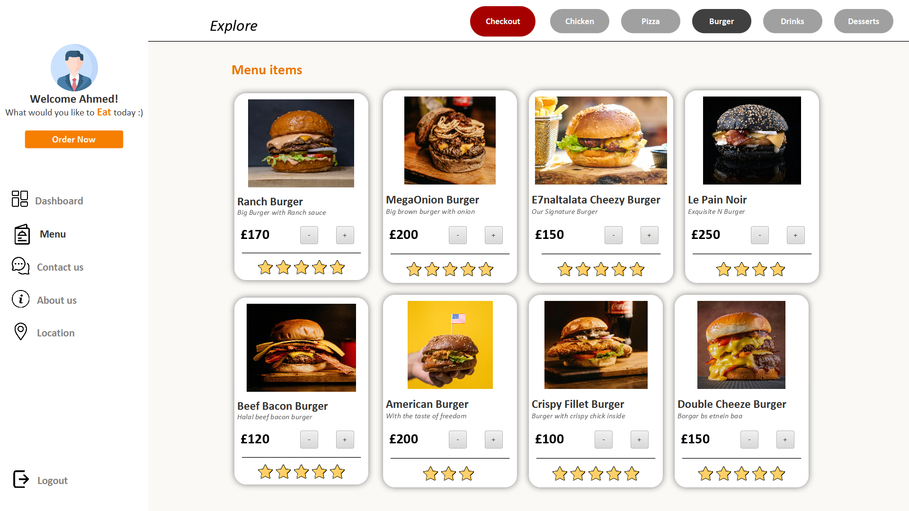

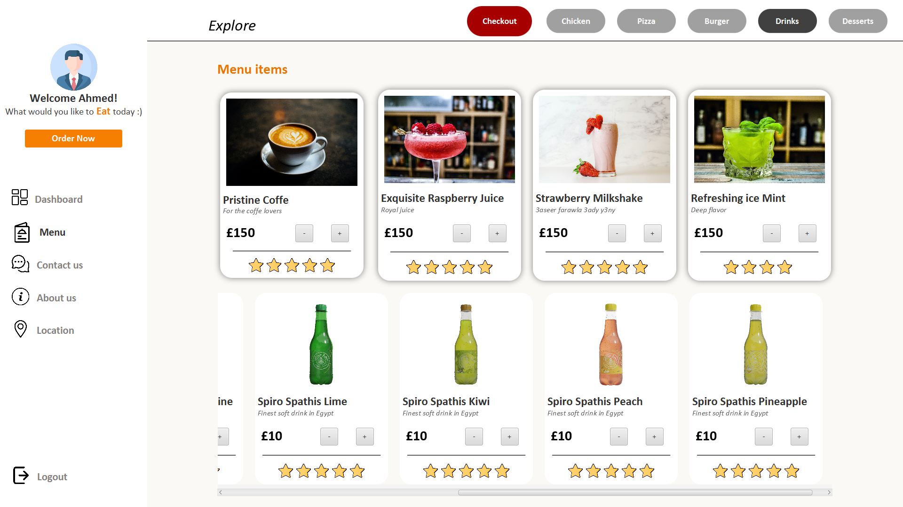
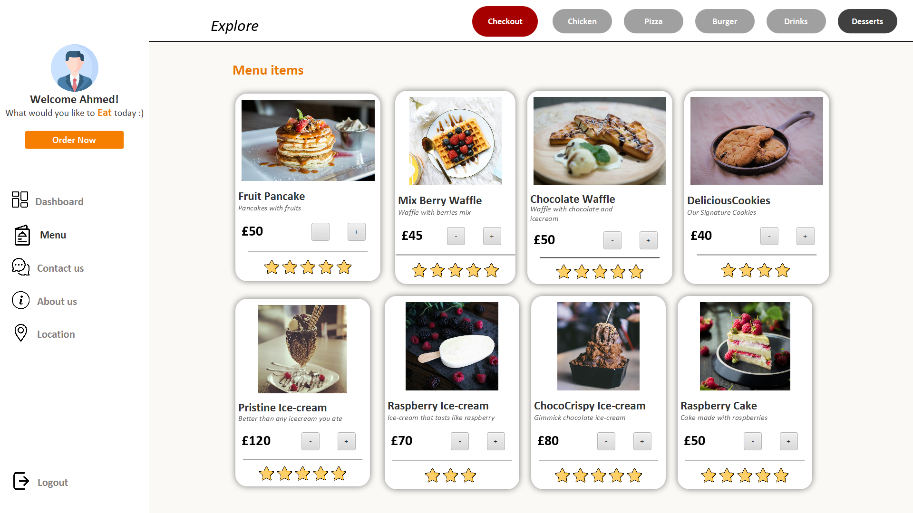
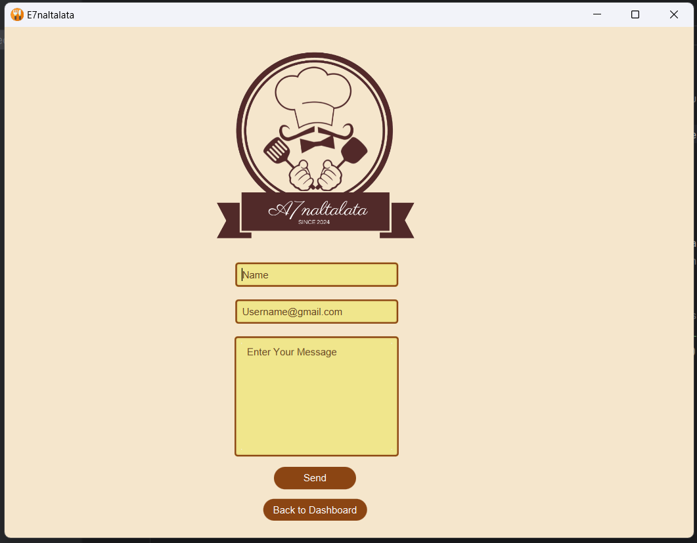
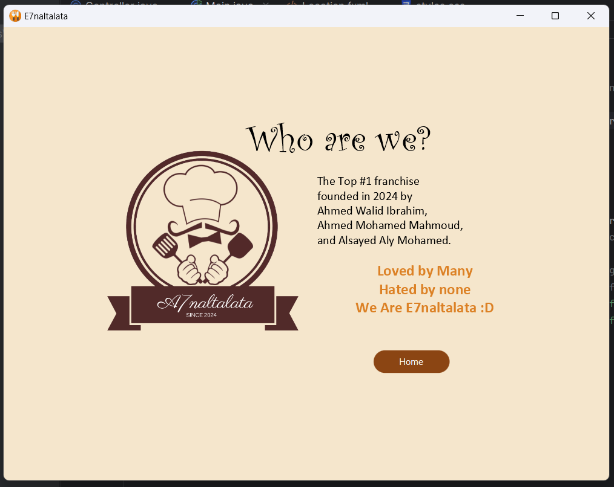
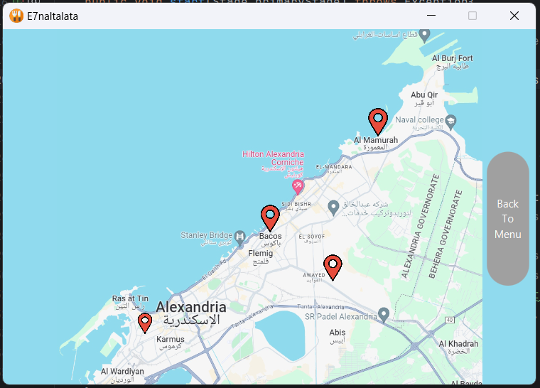
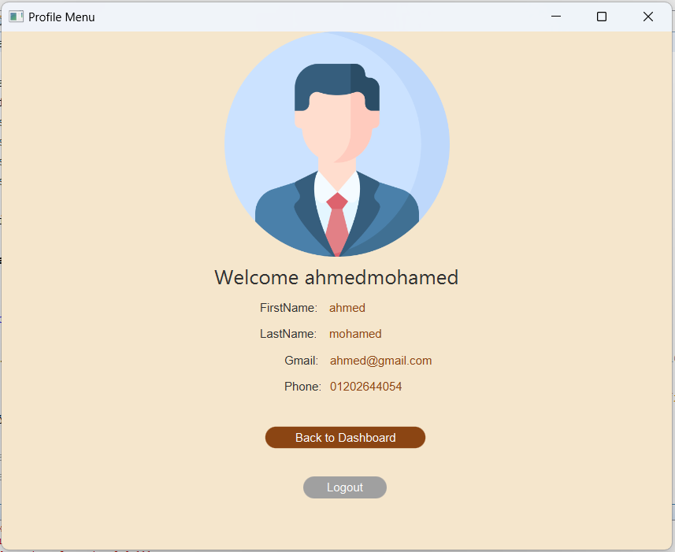
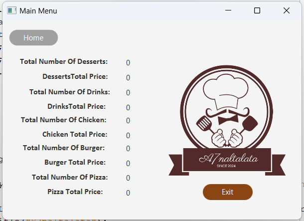

<p align="right">(<a href="#top">back to top</a>)</p>


<!-- CONTRIBUTING -->
# Contributing

Any contributions you make are **greatly appreciated**.


Project Link: [https://github.com/ahmeddwalid/AdvProgProj](https://github.com/ahmeddwalid/AdvProgProj)

<p align="right">(<a href="#top">back to top</a>)</p>


<!-- LICENSE -->
# License

This project is distributed under the [Apache 2.0 license](https://choosealicense.com/licenses/apache-2.0/). See
[```LICENSE.txt```](/LICENSE) for more information.

<p align="right">(<a href="#top">back to top</a>)</p>


<!-- CONTACT -->
# Contact

Ahmed Walid
- [Email](ahmedwalid.c3301@gmail.com)

Ahmed Mohamed
- [Email](ahmedelgeen3@gmail.com)

Alsayed Aly
- [Email](sayedalymadany@gmail.com)
<p align="right">(<a href="#top">back to top</a>)</p>


<!-- ACKNOWLEDGMENTS -->
# Acknowledgments

* [Java Documentation](https://docs.oracle.com/en/java/)
* [JavaFX Documentation](https://openjfx.io/openjfx-docs/)

<p align="right">(<a href="#top">back to top</a>)</p>

